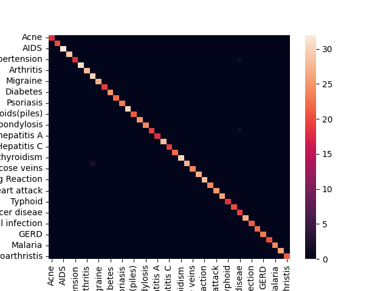

# Health Guardian

## Problem Statement
Develop a healthcare recommendation system that analyzes user symptoms leveraging symptom data (using mock data), healthcare provider databases, and user ratings,  recommends doctors with matching specialties and aligned schedules

## Solution Summary
Recommendation system that recommends a specialist on the basis on user symptoms, user ratings, availability, location.

The app is divided into two segments
1. Online meet that a user can have right nowmin case of immediate help
2. Schedule an in-person meet by choosing which day of the week they are comfortable with and the doctors availability


## Steps to run this file

### Run the following snippets in your terminal:
Step 1: Clone the repository locally ```https://github.com/Pradnya2203/MedicalAssistant.git``` 

Step 2: Move to the directory  ```cd MedicalAssistant``` 

Step 3: Install the required packeges ```pip install -r requirements.txt``` 

Step 4: Move to the frontend  ```cd Frontend``` 

Step 5: Run the app  ```streamlit run Home.py``` 


## Detailed Explanation 

### Dataset

1. Open Source Dataset
2. Mock Dataset


### Machine Learning

#### Random Forest Classifier

#### Results



### Backend

### Frontend

### Design