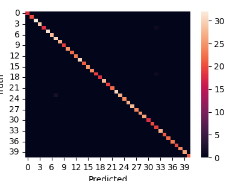
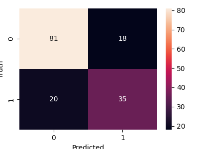
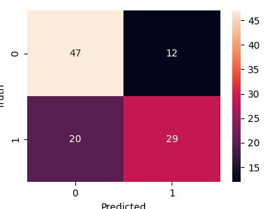

# Health Guardian

## Problem Statement
Develop a healthcare recommendation system that analyzes user symptoms leveraging symptom data (using mock data), healthcare provider databases, and user ratings,  recommends doctors with matching specialties and aligned schedules

## Solution Summary
I have developed a healthcare recommendation system as a web application. It includes a comprehensive list of doctors, each with their specialization, user rating, location, and availability for online sessions or in-person appointments. Users can choose between two types of services: online chat/video call or in-person appointments with doctors in their location.

The system also allows users to list their symptoms, and it analyzes them to suggest possible conditions and the type of specialist they should consult. Additionally, on detecting which disease might have caused the symptoms, the application provides information on the disease and simple preventive measures that a user can take for relief.

Furthermore, there is an additional feature where users can test for the risk of certain diseases, such as diabetes and heart disease, by providing some information about themselves. This feature provides users with an indication of their risk level with a certain degree of accuracy.

Overall, my solution provides a user-friendly platform for users to find the right healthcare provider based on their symptoms, preferences, and location, while also providing valuable information and risk assessment for certain diseases.


## Steps to run this file

### Run the following snippets in your terminal:
Step 1: Clone the repository locally ```https://github.com/Pradnya2203/MedicalAssistant.git``` 

Step 2: Move to the directory  ```cd MedicalAssistant``` 

Step 3: Install the required packeges ```pip install -r requirements.txt``` 

Step 4: Move to the frontend  ```cd Frontend``` 

Step 5: Run the app  ```streamlit run Home.py``` 


## Detailed Explanation 

### Dataset

##### 1. Open Source Dataset
[dataset](https://www.kaggle.com/datasets/itachi9604/disease-symptom-description-dataset/data)
I chose this dataset because it provides a comprehensive mapping of symptoms to diseases, along with recommended precautions and weights. Using this information, I then identified the specific type of specialization that deals with each disease. I created a mapping using Python to associate each disease with its corresponding specialization.
Along with this dataset, the folder also contained a dataset mapping every disease to its definition and another which mapped every disease to its precautionary measures.

[heart disease](https://www.kaggle.com/datasets/danetykpl/risk-factors-for-heart-disease)
[diabetes](https://www.kaggle.com/datasets/piyushborhade/diabetes-dataset)
Apart from this I used two more open-source datasets for classifying the risk of a patient for diabetes and heart disease. I chose these datasets because diabetes and heart disease are among the most common diseases that affect a large portion of the population, and the datasets had a very straightforward implementation.

##### 2. Mock Dataset:
I created a mock dataset of 500 rows using Python. Each row includes the name of a doctor, randomly generated from a combination of names and surnames. The location is also randomly generated from a small list of cities in the USA. The specialization is randomly selected from a set of specialties obtained from the previous dataset. The availability at the moment is indicated by a random 0 or 1, where 0 means unavailable and 1 means available. Additionally, each row includes the doctor's availability for in-person sessions for each day of the week (Monday to Saturday), with specific hours allotted for appointments. This part could be extended to create a complete calendar of a doctor's appointments for the next months, with slots for every working hour indicating availability.


### Machine Learning

#### Random Forest Classifier
A random forest classifier is a machine learning algorithm that uses an ensemble of decision trees to make predictions. It works by constructing a multitude of decision trees during training and outputs the mode of the classes (classification) or the mean prediction (regression) of the individual trees.

In my project, I used a random forest classifier to classify symptoms given by the user to diseases. The input to the classifier was a 17-feature array representing various aspects of the symptoms, and the output was a string indicating the predicted disease. I split the dataset into testing and training sets in an 80-20 ratio. Each input symptom was stored as a weight and passed as an array to the model. I was able to achieve an accuracy of around 99.5% with this approach.

#### Logistic Regression
Logistic regression is a statistical model that is used to predict the probability of a binary outcome based on one or more predictor variables. It is commonly used for classification problems where the output variable is binary, such as predicting whether an email is spam or not spam.

In my project, I used logistic regression to classify the diabetes and heart disease dataset into high risk and low risk categories. The model achieved an accuracy of 75% for diabetes and 70% for heart disease.

#### Results

Heatmap of Symptom-Disease Model

Confusion Matrix of Diabetes Model

Confusion Matrix of Heart-Disease Model

### Website Structure

##### 1. Contact Now:
-Part 1 - Specialist Identification: Users are presented with a list of specialist types (e.g., cardiologist, dermatologist, etc.). They can select the type of specialist they need based on their symptoms or health concerns.
-Part 2 - Symptom Analysis: Users who are unsure about the type of specialist they need can input their symptoms. The application analyzes these symptoms to suggest potential diseases and the corresponding specialist they should consult. This analysis also includes information about the disease and its symptoms, along with preventive measures.
##### 2. Schedule Appointment:
-Part 1 - Specialist Selection: Users who know the specialization of the doctor they want to consult can select from a list of available specialists. The application then recommends specialists available for online chat or video call.
-Part 2 - Symptom-Based Specialist Recommendation: For users unsure about the specialist, they can input their symptoms. The application predicts the possible disease and recommends specialists available on the chosen day. It also provides available time slots for these specialists.
##### 3. Test Yourself:
-Users can input certain information (e.g., age, weight, family history) to assess their risk for diabetes and heart disease. The application provides an analysis of their risk level and may offer preventive measures for these diseases.
##### 4. About Us
-Provides information about the website and its services. Additionally, it offers a feedback form for users to provide their feedback and ratings. This feedback is stored as a text file in the repository and can be utilized to enhance the application.
    
### Backend
For the backend of the website, I saved models that were trained using Jupyter Notebook as pickle files. These models are then used to predict on user data, providing valuable insights and recommendations. Additionally, I utilized other datasets to extract relevant information from user data. By sorting and filtering this data, I was able to provide personalized recommendations and suggestions to users based on their input and needs. This approach ensured that the website's backend could efficiently process user data and deliver meaningful results.

### Frontend
In the frontend of the website, I used the Streamlit library in Python to create an interactive and user-friendly interface for data representation. Streamlit is a powerful tool for building web applications with minimal effort, making it ideal for displaying complex data in a clear and intuitive manner.

With Streamlit, I was able to design a responsive and visually appealing frontend that allows users to easily navigate through the website and interact with the data.

### Design
In the website's theme, I chose a light green shade as the secondary background and a dark green as the primary color. Green is often associated with healing and health, making it a fitting choice for a website dedicated to medical assistance. The color scheme aims to create a calming and reassuring environment for users seeking medical advice and services.